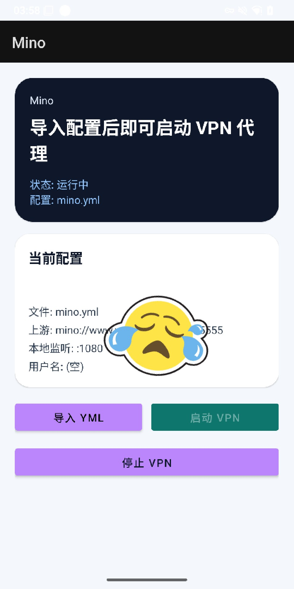

# Mino Android VPN App

## 项目简介

Mino 是一个基于 Android 的 VPN 应用程序，使用 tun2socks 库来实现 VPN 隧道功能。该应用允许用户通过 VPN 服务安全地访问网络。

## 主要特性

- VPN 服务集成
- 前台服务支持
- 网络权限管理

## 演示截图

## 构建要求

- Android SDK 29+
- Gradle

## 构建步骤

1. 克隆项目
2. 打开项目在 Android Studio 中
3. 构建并运行应用

## 许可证

请查看项目许可证文件。
